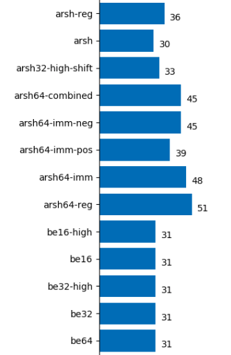
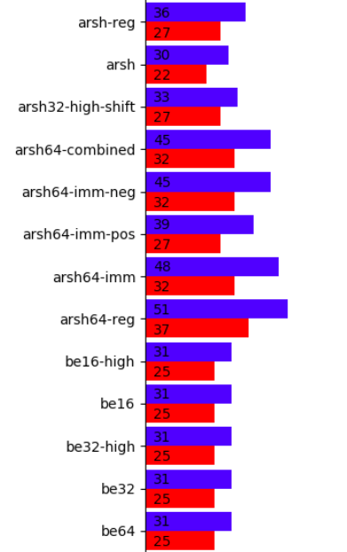

# hBPF test statistics

## Overview

To perform runtime analysis and for possible optimization efforts, hardware unit tests (no emulator or simulator tests) write statistic information into a statistics file per test case. These files have the same name and location (in `tests/data`) as the test definition but with `.stats` extension. Statistic data is written in CSV form with the following fields:

* Timestamp (in `yyyyddmm-HHMMSS` format)
* needed clock ticks
* state of `halt` signal at test end
* state of `error` signal at test end
* flag if test result should be integrated into combined graph (1-Yes, 0-No). This can be specified in a test descriptions `args` section. Setting the `graph` value to 1 includes the results, 0 does not.

This sample shows one entry for the `add` instruction test case:

```
"20210924-153248",30,1,0,1
```

Each test run adds one result line to a test case statistics file.

## Managing test results

To manage statistic results, two scripts exists: `stats_collect.py` and `stats_clean.py`.

### Analyze

To collect single test results into a combined result, the `stats_collect.py` script combines the most recent available result of all test statistics into a combined CSV file for further processing. This CSV file has the same format as above with the name of the test as additional last column:

```
"20210924-153248",30,1,0,1,"add"
```

In addition, a bar chart in PNG format showing clock ticks per test case is created:



The combined CSV and graph can be found in `tests/statistics` folder. Their filenames include a timestamp so that historic results can be kept for comparison.

### Compare

To compare two arbitrary test results the `tests/stats_compare.py` script can be used.
It produces a bar chart showing the difference in clock cycles as shown below:



## Housekeeping

To reduce the number of historic test results the `stats_clean.py` script can be used. It can be called with the maximum number of most recent historic test results which should be kept. If called with an amount of less equal 0, test result files will be removed completely. This script does not affect combined test results and graphs under `tests/statistics`.

To keep 5 most recent statistic test results per test case use:
```bash
stats_clean.py 5
```

*Note: The number of clock cycles in statistics corresponds to the number of cycles for the entire test case (consisting of several opcodes) and not for the op-code instruction itself that it is testing. For cycles per opcode see [here](opcode.md).*