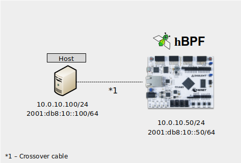
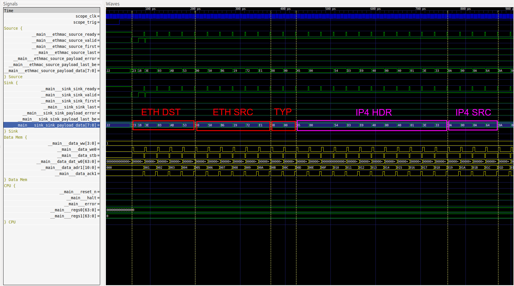

# Arty-A7

To test and debug hBPF this folder contains a simple design which instantiates a
hBPF CPU, connects its status signals to some LEDs and creates a serial Wishbone
Bridge and LiteScope Debugger as shown in the following overview picture. It
also connects to the Ethernet port of the Arty-A7 by using
[LiteETH](https://github.com/enjoy-digital/liteeth).

The bitstream includes a [sample hBPF program](../../../../tests/data/hw/fpga_ping_seq.test)
which looks for IP4 or IPv6 ICMP(6) Echo Requests (Pings) to detect possible
missing sequence numbers. Its a simple program which does not provide any type
of IP4 ARP or IPv6 ND, does not send Echo responses back, and which does not
care about which host send the pings.

To try it out, the following testbed could be used:

Connect a host either directly using a
[crossover cable](https://en.wikipedia.org/wiki/Ethernet_crossover_cable)
or by using a switch to the Arty. Then use the `sc_setup.sh` script to configure the
host interface with IP addresses and a
permanent neighbour cache entry to reach the Arty. Later this can be undone with `sc_clean.sh`.

Next try to ping the Arty under the IP address you configured in the script (e.g. `10.0.10.50` or `2001:db9:10::50`).
You should see the blue Network Activity LED blink each time a ping was
received. Try using different ping speeds, see also `send_pings.sh` script.

Whenever the hBPF program detects a missed ping (missing sequence number), it
sets the blue Network Error LED high. This can be simulated for example by a
short network cable disconnect.

Each time a new ping test is started, the Network Error LED is reset.

To debug (e.g. show a received packet) do the following:
* Run `server-start.sh` to start the wishbone bridge.
* Run `dump.sh` which waits til a network packet is completely received and then creates a `*.vcd` capture file on the host.
* Send exactly one packet from host with `ping -c 1 10.0.10.50`.
* This should trigger a capture on the target. Wait til dump file is completely received on host.
* Use `gtkwave dump.vcd dump.gtkw` to display the capture file.

The physical connections on the Arty:

Build report for the included bitstream can be found
[here](doc/top_utilization_place.rpt).
