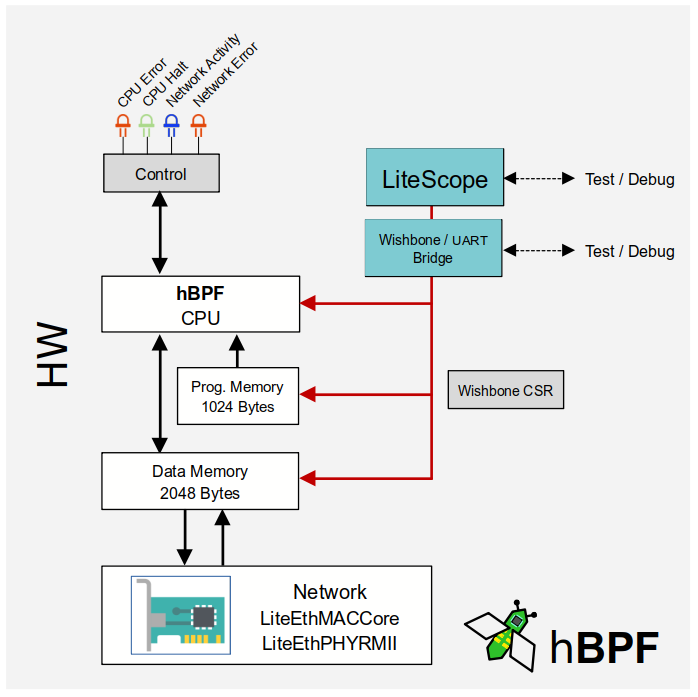
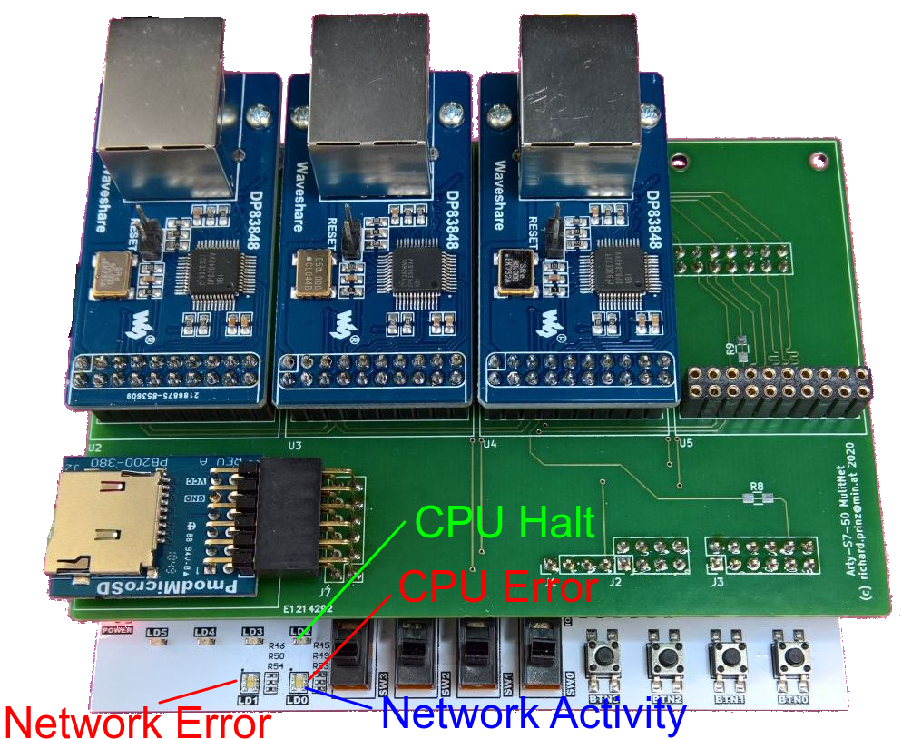
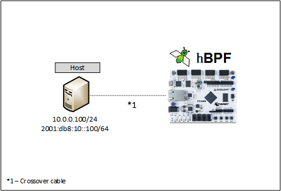

# Arty-S7 MultiNet

The project in this folder uses a Digilent Arty-S7 with a MultiNet expansion board to test [hBPF](https://github.com/rprinz08/hBPF) processing real
network packets.

The Arty-S7 does not have Ethernet out of the box. Therefore
Ethernet for the Arty-S7 was provided using
[MultiNet](https://github.com/rprinz08/arty-s7-multinic).

The project instantiates a hBPF CPU and connects it to a [LiteEth](https://github.com/enjoy-digital/liteeth)
low level [LiteEthMACCore](https://github.com/enjoy-digital/liteeth/blob/c294a3848ecc038f7f8e2e334a4da13f8b1dcf4e/liteeth/mac/core.py#L19) to receive network packets. Some CPU status signals are connected to LED's. A serial Wishbone Bridge and [LiteScope](https://github.com/enjoy-digital/litescope) Debugger are used for debugging.



The physical connections on the Arty-S7:



The program memory already included in the bitstream contains
a simple hBPF program which monitors the sequence number of
received IP4 ICMP Echo requests to see if one was missed. In
that case the network error LED would be set. Any received
packet is visualized using the network activity LED.

This project uses a call handler extension to extend the hBPF
CPU with the ability to control some LED's and also with some
additional storage (besides program- and data-memory) to hold
temporary data. This can be compared with something like maps
in the broadest sense in Linux Kernel eBPF implementation.

```arm
# This program monitors received IP4 ICMP Echo/Ping requests
# and checks that their sequence number is consecutive. It sets the
# error LED at the first lost request.
#
# A request with a lower sequence number then the previous request
# is interpreted as the start of a new test sequence and the error LED is reset.
#
# This program needs call handler support for some hBPF CPU extensions. This
# means the FPGA must run a bitstream containing this call handler extensions.
# See also `source/fpga/hw/arty-s7-50-nic/call_handler.py`

# Get Ethertype from received packet into R4
mov32 r1, 12
ldxh r4, [r1]
be16 r4

# Check if its value is 0x0800 (= IP4)
jeq r4, 0x0800, +1
ja +25

# Check if its an IP4 ICMP packet (= 1)
mov32 r1, 23
ldxb r3, [r1]
jne r3, 1, +22

# Check if IP4 ICMP Echo (Ping) request (= 8)
mov32 r1, 34
ldxb r3, [r1]
jne r3, 8, +19

# Get sequence number of request into R5
mov32 r1, 40
ldxh r5, [r1]
be16 r5

# Read last sequence from store slot 0 (in R1) into R6
# using call handler extension 0xff000003
mov r1, 0
call 0xff000003
mov r6, r0

# If sequence is smaller than last stored,
# set sequence as new start (just store)
# and clear LEDs
jle r5, r6, +1
ja +3

# Clear LEDs (all bits 0 in R1) using call handler
# extension 0xff000001
mov r1, 0
call 0xff000001
ja +5

# If sequence > then last sequence + 1 then
# we missed a request, set packet error LED
add32 r6, 1
jne r5, r6, +1
ja +2

# Set packet error LED (bit 2 in R1) using call handler
# extension 0xff000001
mov r1, 4
call 0xff000001

# Store new sequence number in R5 at slot 0 (in R1) using
# call handler extension 0xff000002
mov r1, 0
mov r2, r5
call 0xff000002

# Return current sequence into R0
mov r0, r6
exit
```

To try it out, setup this simple testbed:



On the host, create a static ARP cache entry so that it
can directly send ICMP Ping ECHO requests without any address
resolution (ARP).

```bash
# Replace <DEVICE> with the network device you want to use e.g. eth1
# Note: Destination IP4 address and MAC address do not mater
# as Arty runs in promiscuous mode.
sudo ip neigh add 10.0.0.50 lladdr 10:e2:d5:00:00:00 nud permanent dev <DEVICE>
```

The Arty-S7 only implements a PHY and MAC from
LiteEth but no higher layers of the stack like IP or ARP.
This effectively means it will not answer the received
ICMP ECHO requests and will accepts and process any packets == it runs in
promiscuous mode.

Now the arty can be pinged using different packet rates:

```bash
# Test 1: Send 60 pings every second
ping -c 60 -i 1 10.0.10.50

# Test 2: Send 120 pings every 0.5 seconds
ping -c 120 -i 0.5 10.0.10.50

# Everything under 0.200 needs root privileges

# Test 3: Send 600 pings every 100ms
sudo ping -c 600 -i 0.1 10.0.10.50

# Test 4: Send 1200 pings every 50ms
sudo ping -c 1200 -i 0.05 10.0.10.50

# Test 5: Send 6000 pings every 10ms
sudo ping -c 6000 -i 0.01 10.0.10.50
```

During a ping test the blue network activity LED should
blink. In case a request is lost the packet error LED will
go on and stays on as long as the test continues. To simulate
one or more missed packets just disconnect and reconnect the
cable during a test for a short moment. The packet error LED
should go on immediately as soon as the cable is reconnected
and the next ping packet is received.

Starting a new ping test clears the packet error LED.

Build report for the included bitstream can be found [here](doc/top_utilization_place.rpt).
