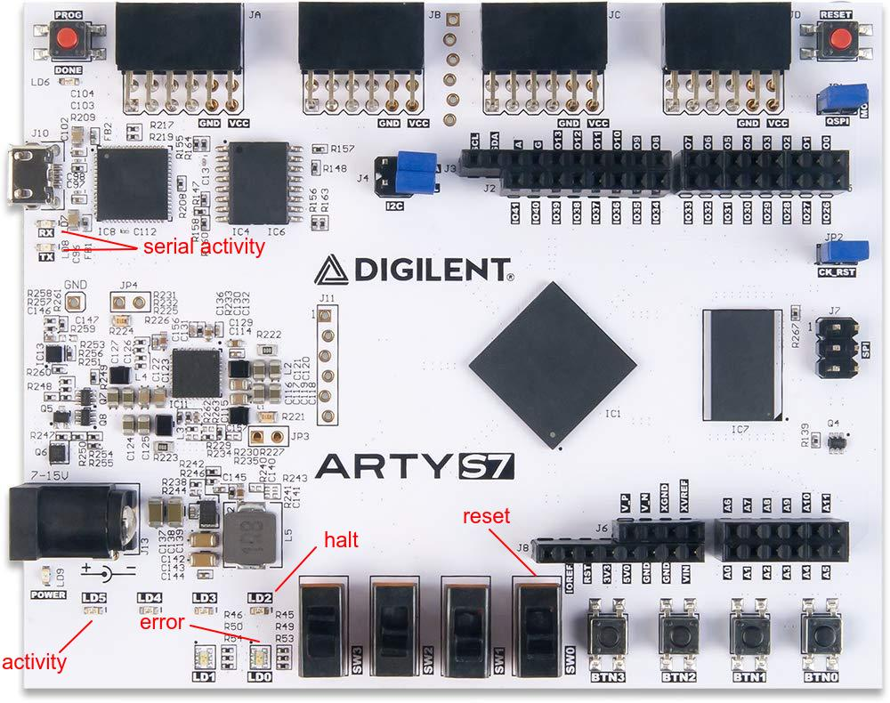

# Arty-S7

The Arty-S7 does not have ethernet out of the box.
It was selected as target because it was available
and provides a decent FPGA device. Ethernet for the
Arty can be provided by [MultiNIC](https://github.com/rprinz08/arty-s7-multinic).

To test and debug hBPF this folder contains a simple
testbench which instantiates a hBPF CPU, connects
its status signals to some LEDs and switches and
creates a serial Wishbone Bridge and LiteScope
Debugger as shown in the following overview picture.

The physical connections on the Arty:

Build report for the included bitstream can be found [here](doc/top_utilization_place.rpt).
