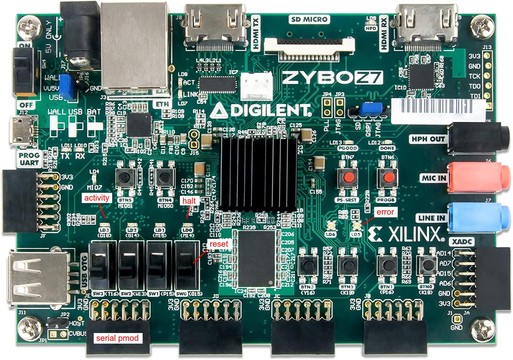

# Zybo-Z7

To test and debug hBPF this folder contains a simple
testbench which instantiates a hBPF CPU, connects
its status signals to some LEDs and switches and
creates a serial Wishbone Bridge and LiteScope
Debugger as shown in the following overview picture.

The physical connections on the Zybo:

Build report for the included bitstream can be found [here](doc/top_utilization_place.rpt).